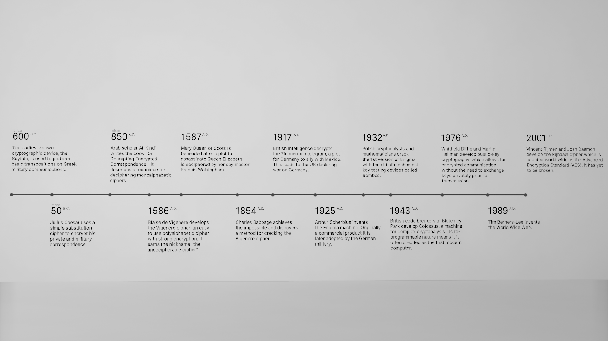
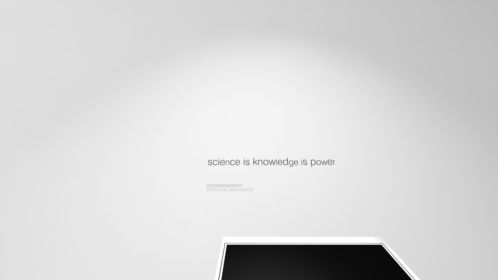

最近在 steam 上看到了一款有趣的游戏叫 `Cypher` ，是关于密码学的，我正好整理一下它的玩法~

关于剧情什么的，如有雷同，纯属巧合~我是瞎编的😂

# 起始密室

## 密室1

你从密室中醒来，发现唯一的门被牢牢地封死。正当你茫然无措的时候，大宇宙意志传达了一个信息：这是小泡泡23333的密码空间，只有解开所有的密码小泡泡才会放你出去。

“什么呀这是！” 你试图砸开这扇门，然而它纹丝不动。考虑到你的小命安全，你不得不从头开始看这些东西。舒缓的钢琴声不知何时响起，你稍稍放松了下来。

在起始密室中，你首先熟悉了一下这个空间的结构：


墙上的是密文，而你需要在控制台中输入解出来的原文。

“反正也没有选择了。”你叹了口气，“接下来就让我来看看都有什么吧。”

墙上写着这样的文字：


> Alice was beginning to get very tired of sitting by her sister on the bank, and of havin**g** nothing to do: once or twice she had peeped int**o** the book her sister was reading, but it had no pictures or conversations in it, 'and what is the use of a book,' thought A**l**ice 'without pictures or conversations?'
>
> So she was consi**d**ering in her own mind (as well as she could, for th**e** hot day made her feel very sleepy a**n**d stupid), whether the pleasure of ma**k**ing a daisy-chain would be worth the trouble of getting up and picking the daisi**e**s, when suddenly a White Rabbit with pink e**y**es ran close by her.

下面还有这温馨的提示：

> You can type 'HINT' into any console for an additional clue.

你敏感地注意到了加粗字符的与众不同之处。将它们拼接起来，你发现它是个熟悉的单词：

```
goldenkey
```

“这也太简单了。”你输入了这串字符。

小门缓缓打开，带着对未知的恐惧，你走了出去。

## 密室2

相比于之前的小屋，这个屋子无疑大了许多。


你的面前是对密码学的介绍，左边是未知的字符矩阵：你猜测它们可能是密钥矩阵；右侧是人类发展密码学的历史。鉴于作者玩这个游戏的目的就是提升自己的英语水平，因此你决定将它们翻译出来。#(滑稽)

### Introduction to Cryptography


> Cryptography is the study of secret messages.
>
> Cryptography has been used throughout history as a means of exchanging private correspondence such as personal letters, important military communications and financial information.
>
> This has create an ongoing race between cryptographers who design increasingly complex ciphers and the cryptanalysts who attempt to crack them.
>
> The six chambers ahead present a series of puzzles designed to introduce you to some of the most common ciphers, and techniques for breaking them. They are arranged roughly in order of complexity.
>
> Cryptanalysis can be a time consuming task requiring patience and focus. The puzzles ahead are largely left to your creativity to solve, but all the clues needed are present within rooms.
>
> So grab a pen and paper and good luck!

>密码学是关于加密信息的一门学科。
>
>在密码学的使用历史中，它一直充当着提高通信私密程度的工具，比如私人信件、重要的军事通信和财务信息。
>
>它使得了加密者——设计越来越复杂的密码的人，与破译者——尝试去破解密码的人之间的战争永不停息。
>
>前方的6个房间展示了一系列谜题，以此来向你介绍一些非常常见的密码和破译它们的手段，它们大致是按照（解密的）复杂程度来排序的。
>
>破译是一件需要耐心与专注度且耗时的事，这些谜题很大程度上是依靠你的创造力去解决的，不过你所需的所有线索都被展示在房间内。
>
>那么拿起纸和笔吧！祝你好运！

### History of Cryptography



- circa. 600 B.C.

> The earliest known cryptographic device, thr Scytale, is used to perform basic transpositions on Greek military communications.

> 已知最早的加密装置——[密码棒](https://baike.baidu.com/item/%E5%AF%86%E7%A0%81%E6%A3%92/7661328?fr=aladdin)（[Scytale](https://en.wikipedia.org/wiki/Scytale)），被用于完成希腊军队交流的基本转换。

- circa. 50 B.C.

>Julius Caesar uses  a simple substitution cipher to encrypt his private and military correspondence.

> 尤利乌斯·凯撒（Julius Caesar）使用了一种简单的[替换密码](https://baike.baidu.com/item/%E6%81%BA%E6%92%92%E5%AF%86%E7%A0%81/4905284?fr=aladdin&fromid=1336345&fromtitle=%E5%87%AF%E6%92%92%E5%AF%86%E7%A0%81)（[Caesar cipher](https://en.wikipedia.org/wiki/Caesar_cipher)）来加密他的私人及军队通讯。

- circa. 850 A.D.

> 阿拉伯学者金迪（Al-Kindi）写了一本叫做《解密加密通讯》（[On Decrypting Encrypted Correspondence](https://en.wikipedia.org/wiki/Al-Kindi#Cryptography)）的书，描述了一种解开单表替代加密法的一种方法。

- 1586 A.D.

> 布莱斯·德·维吉尼亚（Blaise de Vigenère）发明了[维吉尼亚密码](https://baike.baidu.com/item/%E7%BB%B4%E5%90%89%E5%B0%BC%E4%BA%9A%E5%AF%86%E7%A0%81/4905472?fr=aladdin)（[Vigenere cipher](https://en.wikipedia.org/wiki/Vigen%C3%A8re_cipher#Description)），这是一种简单的使用多表替换法的强效的加密法。它有个别称叫做“不可破译的密码”。

- 1587 A.D.

> 苏格兰的玛丽皇后在密谋暗杀伊丽莎白女王的讯息被伊丽莎白的间谍头子[弗朗西斯·沃尔辛厄姆](https://baike.baidu.com/item/%E5%BC%97%E6%9C%97%E8%A5%BF%E6%96%AF%C2%B7%E6%B2%83%E5%B0%94%E8%BE%9B%E5%8E%84%E5%A7%86/10734475?fr=aladdin)（[Francis Walsingham](https://en.wikipedia.org/wiki/Francis_Walsingham#Entrapment_of_Mary,_Queen_of_Scots)）破译后被斩首。

- 1854 A.D.

> 查尔斯·巴比奇（[Charles Babbage](https://en.wikipedia.org/wiki/Charles_Babbage#Cryptography)）实现了一个不可能的事——发现了一种破解维吉尼亚密码的方法

- 1917 A.D.

> 英国人情报部门破译了[齐默曼电报](https://baike.baidu.com/item/%E9%BD%90%E9%BB%98%E6%9B%BC%E7%94%B5%E6%8A%A5/1378012?fr=aladdin)（[Zimmerman telegram](https://en.wikipedia.org/wiki/Zimmermann_Telegram)），消息是德国密谋与墨西哥组成联盟。这导致美国宣布加入第一次世界大战。

- 1925 A.D.


- 

# STEGANOGRAPHY

继续向前走，我们会发现第一关的大门已经打开了。


那就开始愉快地解题吧~

第一关总体来讲就是娱乐的水平，可能连古典密码的水准都达不到。正如其主题 `STEGANOGRAPHY` ，所有密码都隐藏在明文之中。

## PUZZLE 01


一眼就能看出是藏头型的密码问题，PASS~

## PUZZLE 02


emmm...看起来有些单词有问题，是了~

我们把所有有问题的单词所缺(或多出来)的字母拼到一起就是答案啦~

## PUZZLE 03


嗯...横竖看都没有问题，所以是啥呢？？？

靠近了就知道答案啦~

## PUZZLE 04


斜体字必有蹊跷，然而整理起来是： `too one for free` ，输进去也不对啊？

仔细想想，会不会是时间呢？21:43，怕不是逃跑时间(手动滑稽)

## PUZZLE 05


这个我看了好久。。甚至看了 hint 都没看懂。结果走进一看就发现句号有点不对头了。。

## PUZZLE 06


这个开始也没想到，结果只是英文的26个字母。。挠头。我特意查了一下答案 `chrono` 的意思，是“计时”。不得不说我的英语水平还有待提高啊。

## PUZZLE 07


到了最后两个密码啦，其难度有了轻微的提高，当然，只是轻微的哦。

到了这两个，我们就可以看它的提示啦，在门口的屏风背面就是。


很明显，第七题是关于莫斯电码的，只要我们对照着 hint，就可以做出答案啦。

## PUZZLE 08



第一关最后一个密码，“有可能”是最难的吧..？不慌，我们先将可疑点挑出来。

很明显小写字母是其中的特例，挑出来就是 `nlgeiowr` 。但是想一想，直接挑出来这种可能性还是蛮小的，会不会是大写为 0 ，小写为 1 呢？我们试着整理一下：

```
00001 00000 00010 01110 01101
```

共计 25 个字符，那么就以 5 个数字为一组吧~

分成了五组后，很快能想到将二进制转成 10 进制，再看看能不能转成字母。但是其中有一个 0 咋办啊？那不妨以 0 为 A 试试？

结果显而易见啦~

于是第一关就这样愉快地结束了，我们来到了第二关。

# TRANSPOSITION


刚开始玩没多久，慢慢整理吧...

## PUZZLE 01


这个是最简单的栅栏密码了，能一眼看出答案的那种~

## PUZZLE 02


```
teeesrhdebnahhemre
hjwlaeidneettelte

the jewels are hidden beneath the elmtree
```

很明显这才是主菜，一道正常的栅栏密码题。

生词补充：

```
jewels:  珠宝. 貌似是初中词汇
elmtree: 榆树. 这个我是第一次见到qwq
```

那么这个密码的大概意思就是：珠宝藏在榆树下~

## PUZZLE 03


原谅我第一眼就看到了 ELF （逃

```
noitcelfer
reflection
```

这个咋一看可能什么都看不出来，实际上如果能想到倒着看的话就可以秒解了。。

## PUZZLE 04


>  Hint: Try another direction.

咳，虽然我有了想法，但是最后发现阻碍我的还是我的英语水平啊。。

assassin：刺客。像我这种没玩过没看过刺客信条的第一时间还真没反应过来。

知道了这个，其他的就好办多了：

从左下开始，读取方向为右下。其中的 `X` 可能比较碍眼，那么很明显 `X` 就是空格。

然而写完之后发现 `X` 并没有替代所有空格，可能是矩阵只有 7x7。那这样我们可以手动断句。

这样就能得到答案了。

```
ASSASSIN EN ROUTE TRUST NO ONE HIDE THE-JADE-DRAGON.
```

生词补充：

```
assassin: 刺客
en route: adv. 在路上。老词不过早就忘了。
jade:     玉 
```

这句话应该是这样翻译的：刺客确信没有人藏在玉龙中。

PS：那接下来这个刺客就要藏在玉龙中了？

PSS：第一眼看这个矩阵，立马就注意到了 ASS。我需要几包去污粉.jpg


# 参考链接

\[1\]. [ 《Cypher》内的密码简介翻译](https://cowlevel.net/article/1955363) 